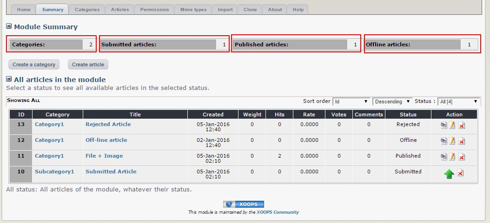
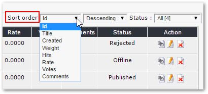
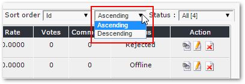
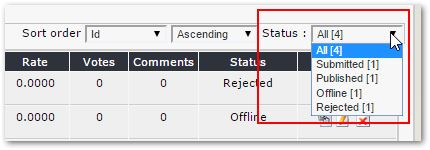

# 4.1 Summary

Here you can see the summary of your activities, showing you the number of categories, number of articles, incl. info about how many are submitted, published, and are off-line. You can also see all of the articles, and you have two buttons on top to create a new Category or new Article:

As you can see here, all articles except the "submitted" one look the same. The "submitted" article has a green arrow to indicate that an action is needed.

You can also define the view in many different ways, for example, by sorting: you select a field that you want to sort on:

and then select the order:

You can also filter by status:

Together it gives you a nice Dashboard to get a better overview of your Blog or News.

