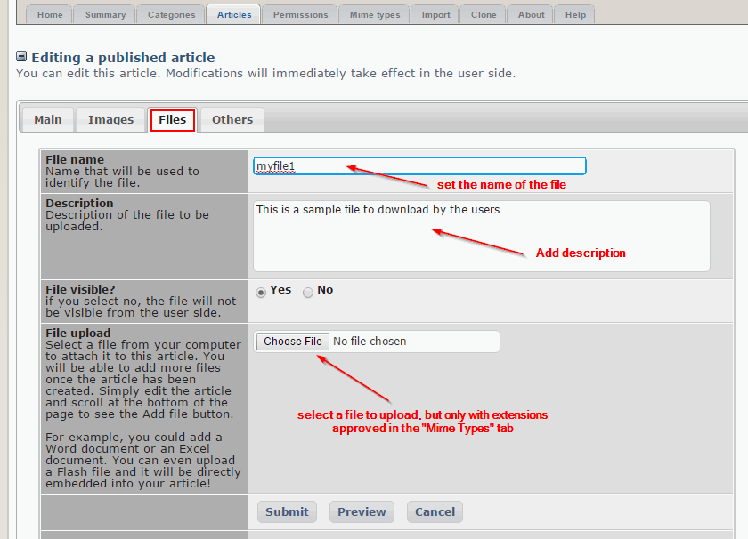
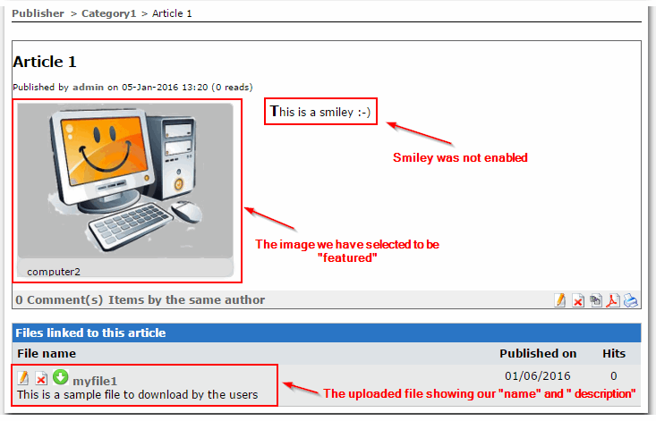

# 4.3.2 Files

The "Files" Tab within the Article is for selecting files that will be available in the Article for download:

You can define the Name and the Description of the file, that the user will see:

In addition to the file now visible to the user and available for download, we can see the image that we selected previously as the "featured" image.

We can also see the effect of not enabling the Smileys.

Please note that the "Edit" and "Delete" icons next to the File are only visible because we are the Admin.

