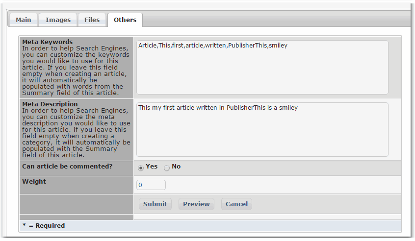

# 4.3.3 Others

In this tab you can make changes to your "Meta Keywords" and "Meta Description" which are useful for Search Engines.

Once the options in ALL tabs are set, you can click on the "Submit" button to save the article.

If you selected the Status as "Published", the article will be available right away to your visitors.

