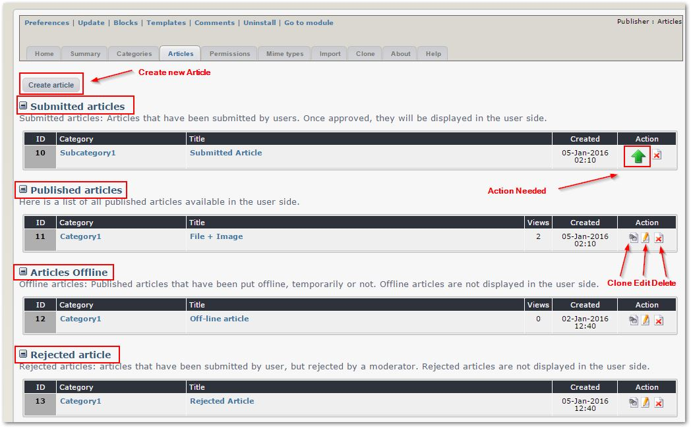
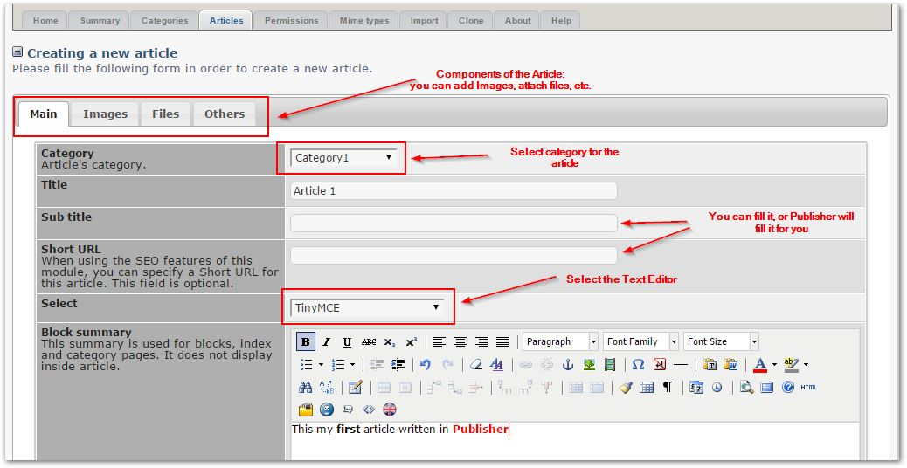
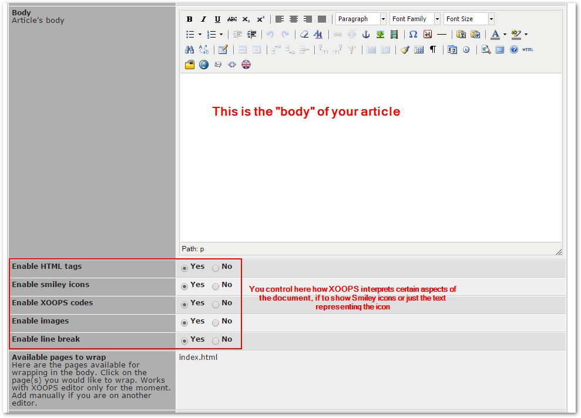
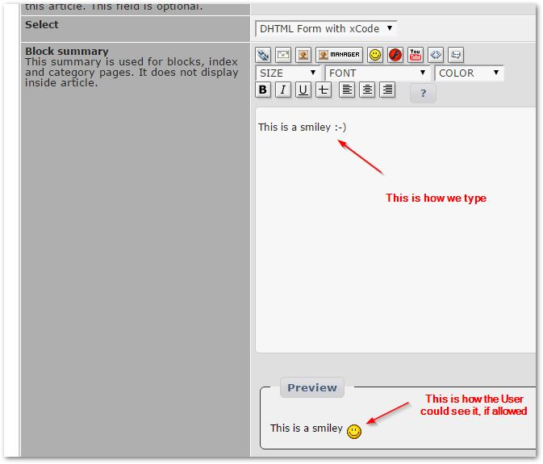
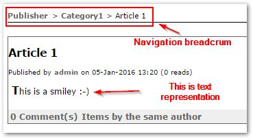
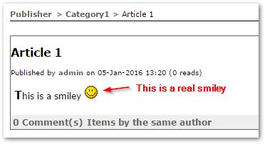
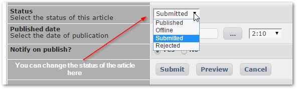
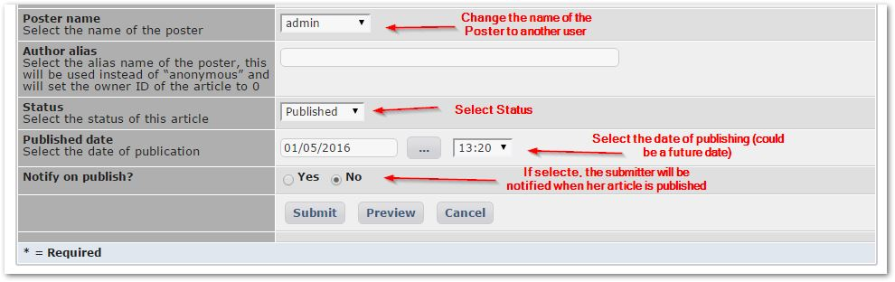
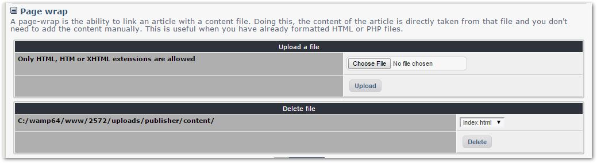

# 4.3 Articles

This tab provides a List of articles, grouped by: Submitted, Published, Offline, and Rejected

You also have there on top a button to create a new Article.

The individual icons for each article show the options you have, e.g. to Clone, Edit, or Delete an Article.

The Green Arrow in "Submitted Articles" should get your attention to show that somebody submitted an article, and you should take action.

So let's click on the button and create now a new article:

Publisher opens a Article form for you, where you can do things like:

* select Category
* add Title of the Article
* select Text Editor that you want to use
* define Sub-Title 
* define Short URL \(if you don't define it, Publisher will make a suggestion for you\)

 Below the Body of the Article, you have several options to tell Publisher how to deal with certain aspects of the document, in case it was written using BB-Codes \(BB stands for Bulletin Board\). This is mainly as a security measure for you as the Admin, in case you don't want your submitters to use certain features. For example, how to deal with Smileys. The code for a smiley is normally ":\)" or ":-\)".

So we type it like here below, and in the preview you can see how XOOPS could interpret it, if allowed:

But the user will see only the text:

unless you specifically "enable" the Smiley icons:

As the Admin, you can also decide for each article the status:

Of course, the regular submitter will not have the choice: the articles will be submitted "as is", however, you'll be able to decide if the articles have to be approved by you, or if they will be automatically published.

Thanks to the sophisticated Permissions systems of XOOPS, you can create different groups for different users with individual rights, for example:

* Moderators: can moderate other people's posts
* Editors: can submit and edit own articles, articles are approved automatically
* Contributors: can submit, each article has to be approved

And finally, you can set status, date, and notification, and submit the Article.

There is also an option to import and use documents already written that you have saved in files. Publisher can provide links to these documents. You need to copy such documents manually to the /uploads/publisher/content folder, or you can upload them inside of Publisher:

