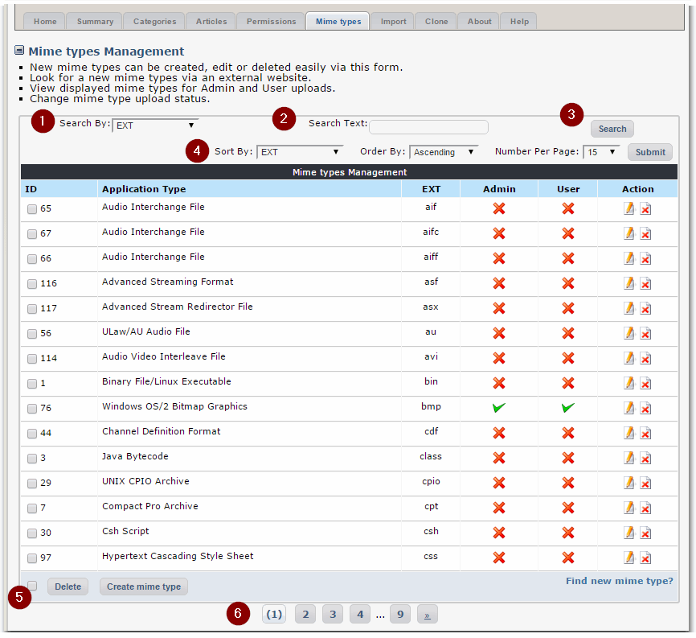

# 4.5 Mime Types

This tab provides an overview of available file extensions, where you can decide who can upload what extension.

MIME \(Multipurpose Internet Mail Extensions\) types were originally defined for email. They became known as **media types** when it became apparent that their usage had expanded to protocols which did not relate specifically to mail.

You can decide here which extensions users can upload to Publisher:

To make it easier for you, there are several ways how you can manage the MIME types:

* **Search**: \(1\),\(2\),\(3\) - you can do Search by specifying what word you want to search for, and which field \(ID, Application Type, Extension\) you want to search on. 
* **Sort**: \(4\) you can select which field you want to use sort on \(ID, Application Type, Extension, Admin, User\), and how many entries per page you want to see
* **Delete**: \(5\) you can select either
  * individual MIME types on the page, or 
  * all of them by clicking on the checkbox next to the "Delete" button and

    delete the selected MIME types.
* **Pagination**: it makes the navigation much easier. You can define how much entries per page you want to see by selecting the number in the "Number per Page" box

You can also create your own MIME types.

