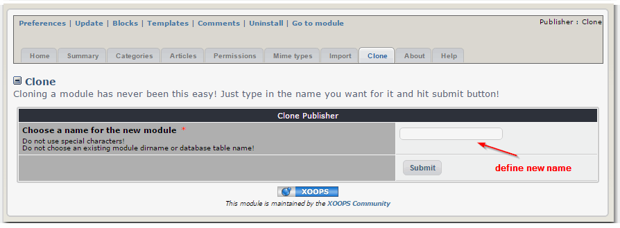

# 4.7 Clone

If you need separate Publisher instances under different names, you can "clone" Publisher here.

This is useful, if you have different blogs, and you would like to have, for example, one for Movies, one for Books, and another one for Music.

Just define a new name, e.g. "movies" and click on the "Submit" button, and you have a a second Publisher module called "Movies"

