# Blocks

Blocks are discreet sections of content that can be created and configured in the admin interface. Custom blocks can be created and are typically made up of text, graphics and pictures. The content in these blocks may be formatted individually or inherit the site formatting. Blocks may also be part of a modules display output. The blocks administration page is where all blocks are configured and administered.

Blocks are like a newspapers' front page: they are teasers that incite readers to read more complete stories in the inside pages. Blocks offer small bits of dynamic content with links to the actual content stored in the module. They are often used to place HTML content, banners or pictures, and the site administrators can easily create their own blocks with the "custom block" feature.

For more information about Blocks, please visit the [Blocks section of our **XOOPS Operations Guide**](https://xoops.gitbooks.io/xoops-operations-guide/content/book/Blocks2.html)

Publisher has **following 11 Blocks** available to use:

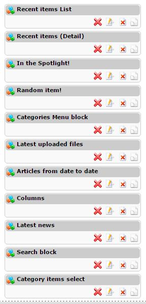

Here you can see a overview of the individual Blocks:

| **Block** | **Purpose** |
| --- | --- |
| Recent items List | List of Recent Articles |
| Recent items \(Detail\) | Recent Items in more detail |
| In the Spotlight! | Shows the articles currently in the "Spotlight". You can define the criterio to be in the Spotlight |
| Random item! | Random articles |
| Categories Menu block | This is the Menu block showing Categories |
| Latest uploaded files | Shows latest uploaded files that have been added to articles |
| Articles from date to date | Allows to select Articles from a given time between two dates |
| Columns | Shows Columns |
| Latest news | Shows the latest News from Publisher |
| Search block | A private search block for Publsher items |
| Category items select | You can select here articles from a particular Category |

Let's go and discuss them now in detail:

## Recent items List

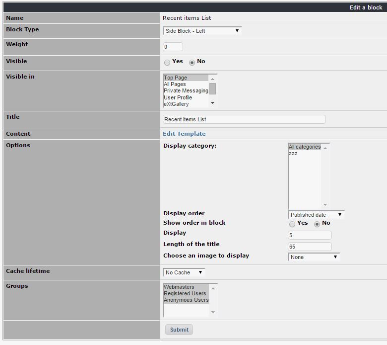

## Recent items \(Detail\)

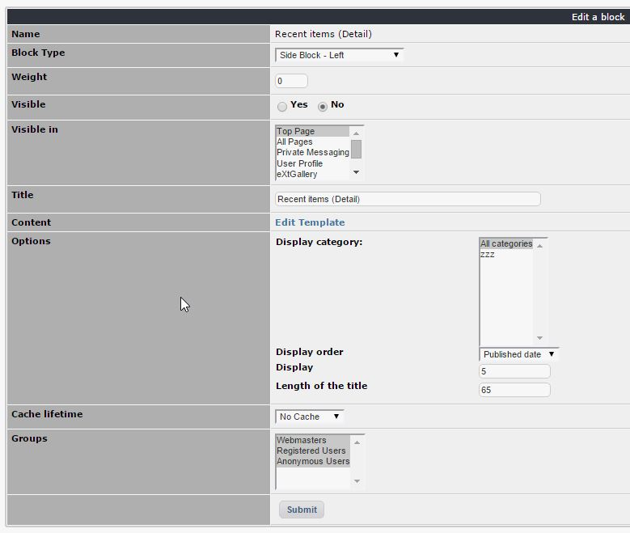

## In the Spotlight!

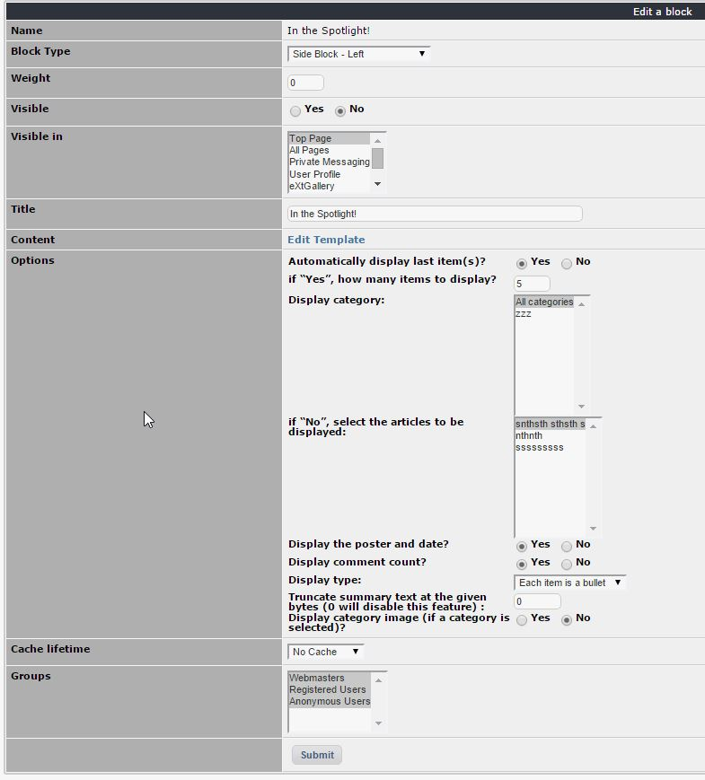

## Random item!

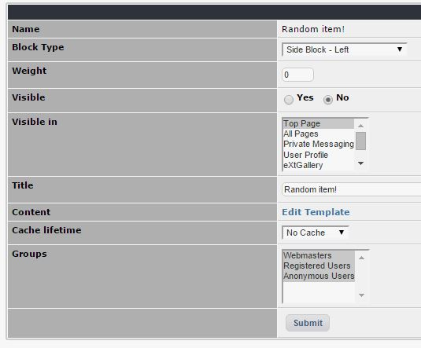

## Categories Menu block

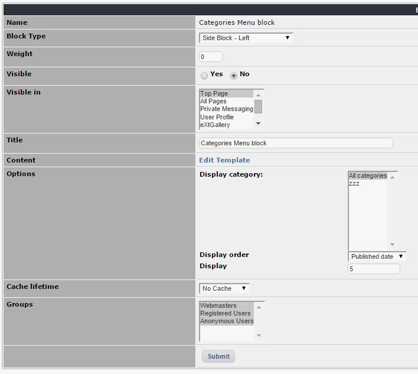

## Latest uploaded files

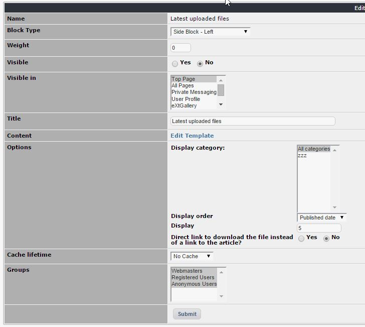

## Articles from date to date

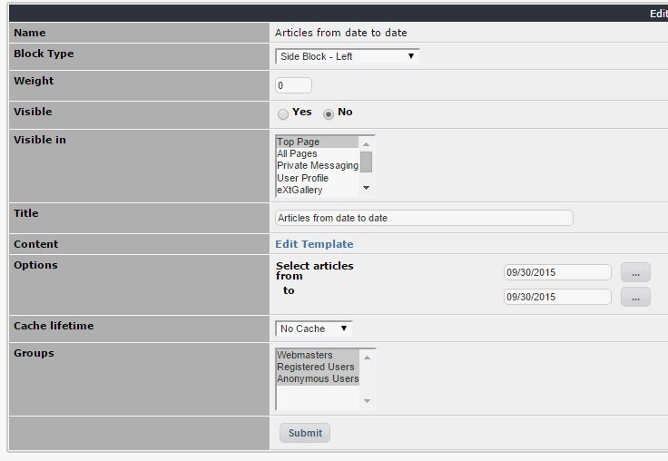

## Columns

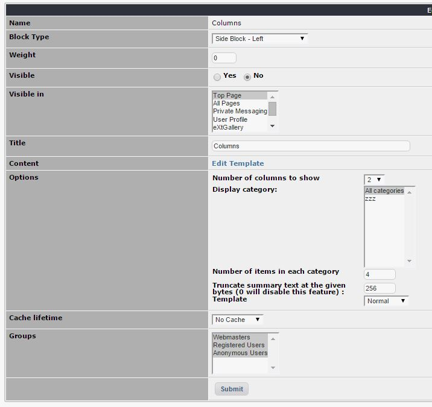

## Latest news

  

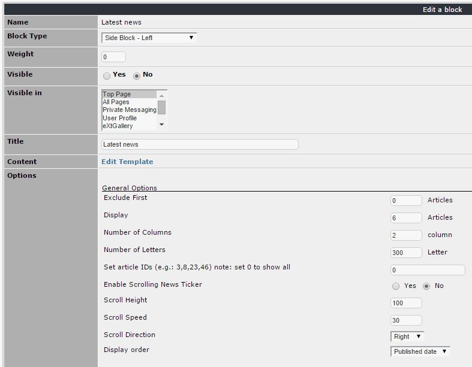

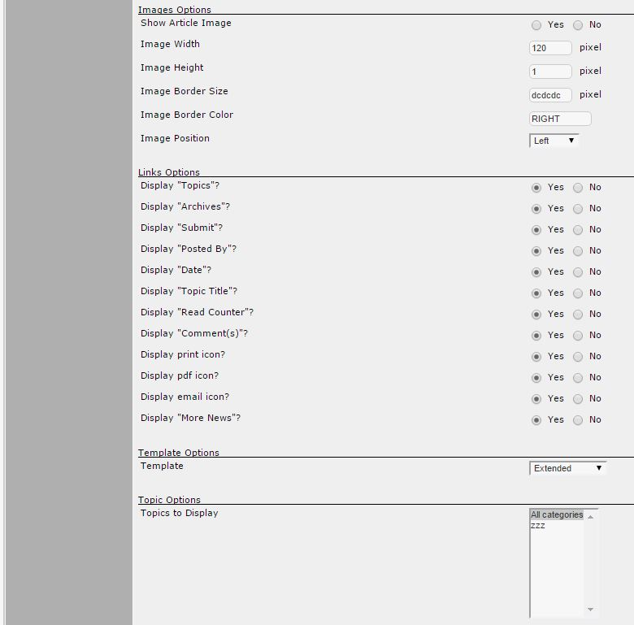

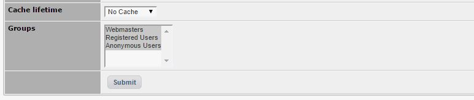

## Search block

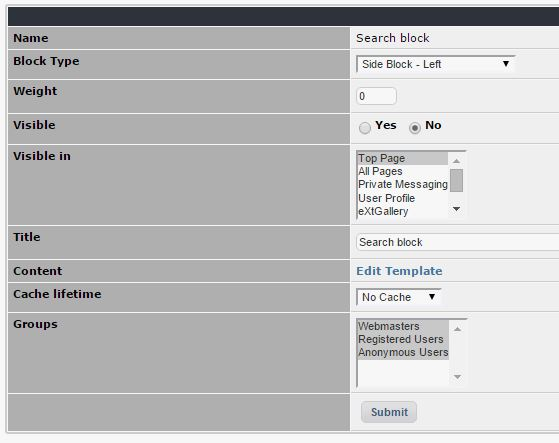

## Category items select

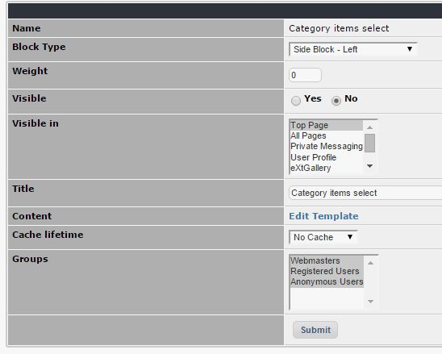

