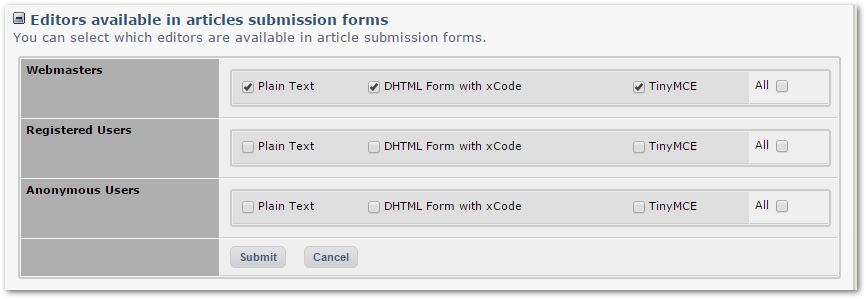

# 4.4 Permissions

This tab shows detailed permissions for various aspects of Publisher.

There are several key sections for Permissions to:

- View Categories
- Submit Articles
- Moderate Article within each Category
- use special extra fields as a submitter
- use specific Text Editors provided by XOOPS
- search and rate articles
 
Let's discuss these sections in more detail:

### Permission to View Categories

### Permission to Submit Articles

### Permission to Moderate Article within each Category

### Permission to use special extra fields as a submitter

### Permission to use specific Text Editors provided by XOOPS

### Permission to search and rate articles

