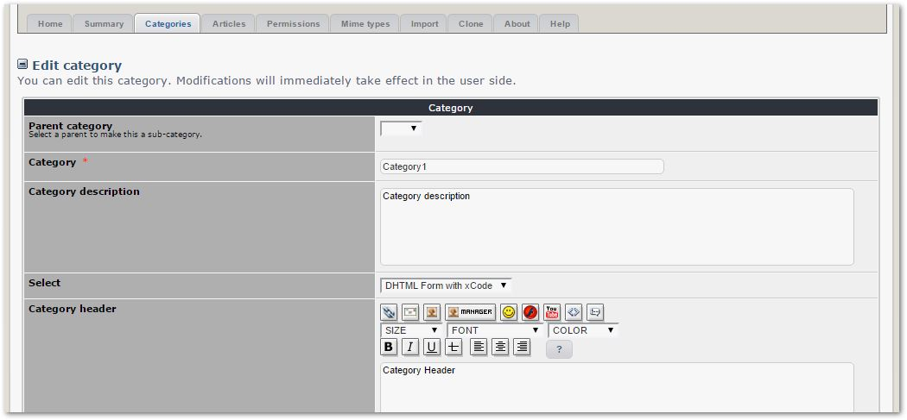
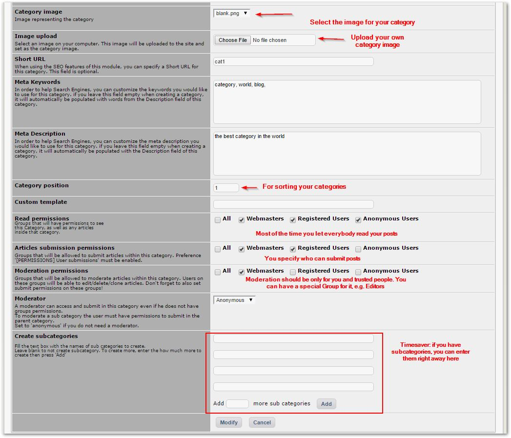
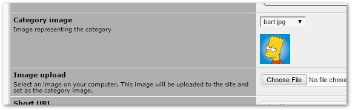

# 4.2 Categories

This Tab shows a list of all created categories of the module.

You can create a new Category by clicking on this button:

After that Publisher present you with a form to fill out with required and useful information. The "required" fields are marked with a red star, as here the name of the Category below: 

You can also upload your custom image for the Category, and decide who can view the posts in this category, as well as define the sorting number. In addition, you can add specific Meta Keywords and Meta Description for the Category, which is useful for Search Engines like Google.

This is how Publisher will show you the Category Image that you have uploaded:

You can change the structure of the categories at any time, by simply changing which category is the parent:

