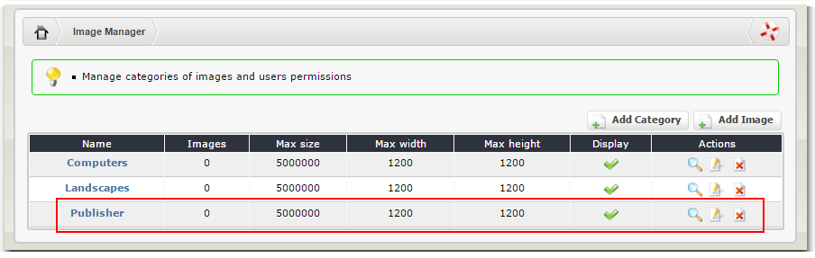
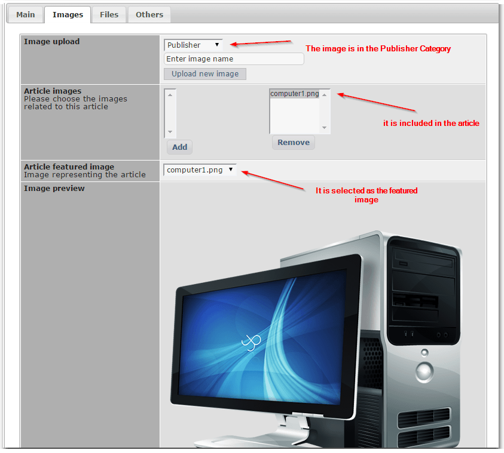

# 4.3.1 Images

Publisher is using the XOOPS ImageManager to manage its images.

When you open the "Images" Tab, you'll be able to select the Image Category from the XOOPS ImageManager, and either use one of the already available images or upload a new one.

If you didn't do it yet, you can go to the ImageManager and create a special category for your Publisher Images. The best way is to go to the Modules Admin by clicking on the Modules menu:

and then click on the "ImageManager" icon:

Once there, you can see what categories you already have, if any, and how many images each of them has. 

Let's create a new Category for Publisher:

Here you can set the Category name, select groups that will have access to that category, and the maximum image sizes:

Once this is done, let's save it:

Now we can add the images here, or we can go back to the Publisher and upload the images there. First, we need to select the category to which will upload the pictures to, so let's select the "Publisher": 

then click on the "Upload new image" button, and select an image from your local drive. Once this is done, you new image will be visible in Publisher, and it will be automatically added to the "article images", and it will be selected as the "featured image":

We can upload few more images, and then select which will be included in the article, and which will be the featured one:

We can also check out the images in the XOOPS ImageManager: 

> **NOTE: **Please note that if you don't specify a name of the image before the upload in Publisher, Publisher will just use the name of the file.

We can also make changes, so if we decided that we want to change the "visible" name of the image, we can do it right there by clicking on the "Edit" icon:

and changing the name in the provided form:

and the changes will be visible back in the Publisher:

Once we're done we can click on the "Submit" button to save the changes to the Article. Make sure that you have fill out all the other information in the "Main" tab.

