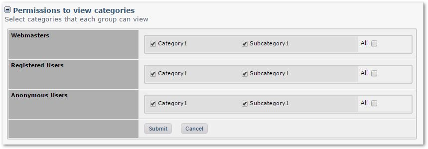

# 4.4 Permissions

This tab shows detailed permissions for various aspects of Publisher.

There are several key sections for Permissions to:

- View Categories
- Submit Articles
- Moderate Article within each Category
- use special extra fields as a submitter
- use specific Text Editors provided by XOOPS
- search and rate articles
 
Let's discuss these sections in more detail:

### Permission to View Categories

You have listed here ALL categories and sub-categories, and ALL groups of users. You can then select which group can see which category. 

For example, you could create a private group for paid subscribers interested in Antiques, and only they could see a specific Category dedicated to Antques. 

### Permission to Submit Articles

The same as above, but you can decide who can submit Articles to which Category

### Permission to Moderate Article within each Category

Here you can decide which Group can moderate which Category.

For example, for the Subcategory1 you can create a special Category called "Sub1-Moderators" and assign specific users to moderate it.
### Permission to use special extra fields as a submitter

These are extra fields that can be made available to specific group. Please view the image below: this is the Article submission form **without** any of these special: fields.

If you compare it to the images shown in the Articles section, this is a huge difference! 

Below is more info about the individual fields. Please test them, so you feel more comfortable, and can make a better decision which ones are the most appropriate for your Blog or News. 

|**Field**|**Description**|
|---|---|
|Introduction||
|Available pages to wrap|Should the submitter be able to create links to wrap documents |
|Tags|Can the submitter see and submit tags for the article?|
|Article image|Option to be able to submit images|
|File upload|Option to submit files|
|Poster name||
|Published date|Can the poster set the date of publishing?|
|Status|Can the poster set the status of the article?|
|Short URL|Can the poster set the Short URL?|
|Meta Keywords|Can the poster add Meta Keywords?|
|Meta Description|Can the poster add the Meta Description?|
|Weight|Can the poster set the weight for sorting?|
|Can article be commented?|Can the poster decide who can submit comments?|
|Enable HTML tags|Can the poster enable/disable HTML codes?|
|Enable smiley icons|Can the poster enable/disable Smiley icons?|
|Enable XOOPS codes|Can the poster enable/disable XOOPS codes? |
|Enable images|Can the poster enable/disable images in the article?|
|Enable line break|Can the poster enable/disable line breaks?|
|Notify on publish?|Can the poster set the notification after publication? |
|Sub title|Can the poster add a sub-title?|
|Author alias|Can the poster set her Alias? |

### Permission to use specific Text Editors provided by XOOPS

This are the standard Text Editors provided by XOOPS, however, you can download and install many others
### Permission to search and rate articles

Here the Admin can decide which groups can search on articles, and which one can rate the articles.

